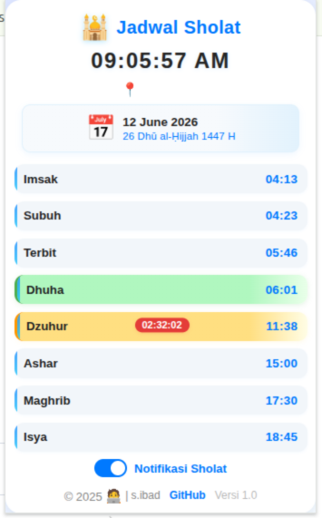

# Jadwal Sholat Chrome Extension

Ekstensi Chrome modern dan responsif untuk memantau jadwal sholat harian secara otomatis berdasarkan lokasi Anda, lengkap dengan notifikasi tepat waktu.



## Fitur

- Deteksi lokasi otomatis (menggunakan OpenStreetMap/Nominatim)
- Tampilkan waktu sholat: Imsak, Subuh, Terbit, Dhuha, Dzuhur, Ashar, Maghrib, Isya
- Highlight waktu sholat berikutnya dan waktu sholat yang sedang berlangsung
- Tanggal Masehi dan Hijriyah
- Desain modern dan minimalis
- Mendukung dark mode Chrome
- **Tombol ON/OFF notifikasi sholat**
- **Notifikasi & alarm otomatis ketika waktu sholat tiba**

## Cara Install (Development)

1. Clone atau download repository ini.
2. Buka Chrome, masuk ke `chrome://extensions/`.
3. Aktifkan **Developer mode** (Mode Pengembang).
4. Klik **Load unpacked** (Muat tanpa paket) dan pilih folder `jadwal_sholat`.
5. Ekstensi siap digunakan!

## Struktur File

```
jadwal_sholat/
├── popup.html
├── popup.css
├── popup.js
├── manifest.json
└── readme.md
```

## Sumber Data

- [Aladhan API](https://aladhan.com/prayer-times-api) untuk jadwal sholat
- [Nominatim OpenStreetMap](https://nominatim.openstreetmap.org/) untuk deteksi nama kota

## Kontribusi

Pull request dan saran sangat terbuka!  
Silakan fork dan kembangkan sesuai kebutuhan Anda.

---

## Catatan: Mengaktifkan Lokasi di Chrome

Agar ekstensi dapat mendeteksi lokasi Anda secara otomatis, pastikan:
- Chrome **mengizinkan akses lokasi** untuk ekstensi ini.
- Jika muncul permintaan izin lokasi di popup, klik **Izinkan**.
- Jika lokasi tidak terdeteksi, cek pengaturan Chrome di `chrome://settings/content/location` dan pastikan tidak memblokir ekstensi ini.

---

## Catatan Tambahan

- Kini tersedia **tombol ON/OFF notifikasi** di popup untuk mengaktifkan atau menonaktifkan notifikasi waktu sholat.
- Jika notifikasi diaktifkan, popup akan menampilkan notifikasi dan suara alarm (jika diaktifkan di kode) setiap kali waktu sholat tiba.
- Preferensi notifikasi akan tersimpan otomatis dan tetap aktif/disable meski popup ditutup.

---

@2025 🧑‍💻 oleh s-ibad
